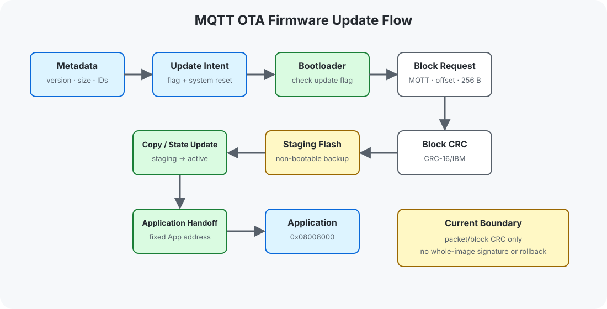

# 嵌入式 OTA 升级实验室
## Embedded OTA Update Lab

基于 GD32F407VE / ARM Cortex-M4，围绕 Bootloader、应用偏移、UART/YMODEM IAP、MQTT 固件传输、Flash 更新与完整性校验组织的嵌入式固件升级仓库。


## 👋 项目简介 | Overview

仓库保留 5 条递进主线，将内部 Flash 操作、Bootloader/Application 配对、本地 IAP 和网络 OTA 组织为同一条 Firmware Update 路径。Bootloader 与 Application 按系统成对保存，地址配置、向量表偏移和传输协议可以在同一入口核对。

当前工程是更新机制的参考实现，不包含固件签名、加密、Secure Boot、自动回滚或可启动 A/B Slot。

## ⚙ 技术范围 | Technical Scope

- **Flash Foundation**：内部 Flash 擦除、写入、读取与分区边界。
- **Boot Handoff**：初始 MSP、Reset Vector、固定地址跳转与 Application VTOR 重定位。
- **UART / YMODEM IAP**：128/1024-byte packet、序号、ACK/NAK/EOT 与 CRC-16/XMODEM。
- **OTA Control Plane**：版本元数据、更新标志、复位交接与 Bootloader 更新入口。
- **MQTT Block Transport**：ESP8266 类 AT 模组、Aliyun IoT OTA topic、分块请求与 CRC-16/IBM。
- **Image State**：Active App、Staging Backup、Update Info 与 Parameters。

## 🧠 系统架构 | Architecture

```text
Firmware Source / Aliyun IoT
              ↓
UART YMODEM / MQTT Block Transport
              ↓
Update Control and Packet CRC
              ↓
Internal Flash Programming
              ↓
Bootloader Decision and Application Handoff
```

OTA Application 负责版本查询和更新意图；复位后，Bootloader 接收分块、写入 Staging Backup，再复制到固定 Active App 区。Staging 区不作为第二个可启动 Slot。



- [Bootloader architecture](docs/bootloader-architecture.md)
- [Flash layout](docs/flash-layout.md)
- [Application jump](docs/application-jump.md)

## 🚀 核心工程 | Featured Projects

### [Flash Programming Foundation](projects/01-flash-basics/)

GD32F407 内部 Flash 的 sector-aware erase、read 与 write 基础。

### [Bootloader / Application Split](projects/02-boot-app-split/)

Bootloader 与 `0x08004000` Application 的成对工程，包含 MSP/Reset Vector 跳转和 `VTOR` 偏移。

### [UART / YMODEM IAP](projects/03-ymodem-iap/)

以 UART/YMODEM 传输 raw firmware，使用 CRC-16/XMODEM 校验 packet 后写入 Application 区。

### [OTA Control Plane](projects/04-ota-control/)

Application 侧的版本元数据、更新确认、更新标志和复位交接流程。

### [MQTT OTA System](projects/05-mqtt-ota-system/)

ESP8266 类 AT 模组承载 Aliyun MQTT OTA 分块传输；Bootloader 将数据写入 Staging Backup，再复制到固定 Application 区。

## 📂 仓库结构 | Repository Structure

```text
assets/images/           自有 OTA 架构、Flash Map 与更新流程图
docs/                    Bootloader、IAP、OTA Transport 与边界说明
projects/                5 条主线系统；Bootloader/Application 成对组织
SOURCE_SELECTION_MANIFEST.csv
MIGRATION_HASH_VERIFICATION.csv
```

## 🛠 开发环境 | Development Environment

- GD32F407VE / ARM Cortex-M4
- Keil MDK-ARM / ArmClang project definitions
- GigaDevice GD32F4xx DFP 3.2.0
- GD32F4xx Standard Peripheral Library / CMSIS
- ESP8266-class AT Wi-Fi module in the network OTA path

历史构建日志未纳入公开仓库，也不作为本轮构建通过证据。当前环境状态见 [Development Environment](docs/development-environment.md)。

## 📖 技术文档 | Documentation

- [Bootloader Architecture](docs/bootloader-architecture.md)
- [Flash Layout](docs/flash-layout.md)
- [Application Jump](docs/application-jump.md)
- [UART / YMODEM IAP](docs/ymodem-iap.md)
- [OTA Control Plane](docs/ota-control-plane.md)
- [MQTT Block Transport](docs/mqtt-block-transport.md)
- [Image Integrity](docs/image-integrity.md)
- [Failure Boundaries](docs/failure-boundaries.md)
- [Development Environment](docs/development-environment.md)

## 📜 来源与许可 | License

公开快照排除了构建产物、历史日志、IDE 用户状态、固件二进制和许可不明视觉资源。最终 OTA 工程中的网络与云端凭据已在公开派生副本中替换为占位符；变更范围记录在两个迁移 Manifest 中。

仓库新增 Markdown 与自有 SVG 适用根目录 [LICENSE](LICENSE)。迁移源码保留原有版权头并继续受各自条款约束，详见 [THIRD_PARTY_NOTICES.md](THIRD_PARTY_NOTICES.md)。
