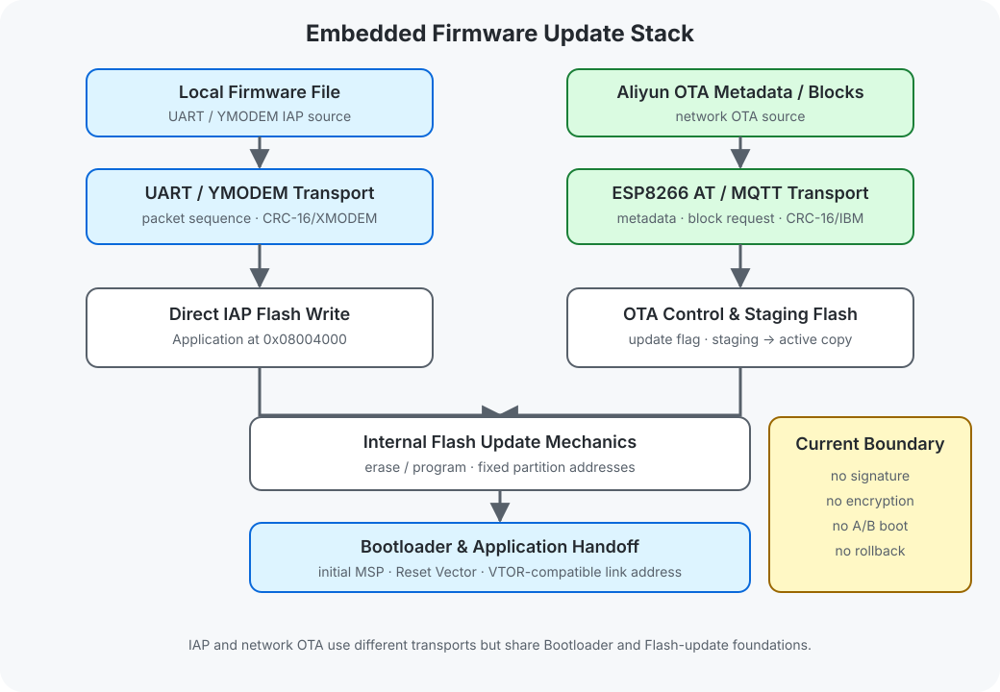

# Embedded-OTA-Update-Lab

基于 GD32F407VE / ARM Cortex-M4 的嵌入式固件更新架构实践仓库，重点展示 Bootloader、UART/YMODEM IAP、MQTT 分块传输、Flash 布局和 CRC 完整性检查。

## Overview

仓库围绕 Cortex-M 固件更新的基础机制组织独立系统：内部 Flash 擦写建立存储基础，Bootloader 与 Application 使用固定地址和向量表偏移完成启动交接，UART/YMODEM 提供本地 IAP，MQTT block transport 提供网络固件传输路径。

本地 IAP 与网络传输使用不同的数据入口，但共享 Bootloader、Flash programming、Application handoff 和 CRC 错误检测基础。仓库展示的是更新架构与代码路径，不描述为完整、生产级或已经在线验证的 OTA 产品。

## Platform & Technology

| Field | Value |
| --- | --- |
| Language | C |
| Platform | GD32F407VE / ARM Cortex-M4 |
| Toolchain | Keil MDK-ARM, ArmClang, GigaDevice GD32F4xx DFP |
| Architecture | Bootloader, UART/YMODEM IAP, MQTT block transport, Flash layout, CRC integrity check |
| Verification | Source and project-configuration review; build, hardware and runtime status are listed below |

## Architecture



仓库能力按以下路径递进：

```text
Bootloader
      ↓
UART / YMODEM IAP
      ↓
MQTT Transport
      ↓
CRC Integrity Check
```

运行时，UART/YMODEM 与 MQTT 是两条独立 Transport：前者将 packet 写入固定 Application 区，后者将 firmware block 写入 Staging Backup，再复制到固定 Active App。两条路径都依赖 Bootloader 和内部 Flash，但不是同一个连续传输链。

Staging Backup 只是下载暂存和复制来源，不是可启动 Slot B 或 A/B Partition。CRC 只用于传输或存储错误检测，不提供加密、数字签名、来源认证、Secure OTA 或 Automatic Rollback。

## Key Features

| Capability | Implementation Entry |
| --- | --- |
| Bootloader structure | [Bootloader Architecture](docs/bootloader-architecture.md) 与 [Application Jump](docs/application-jump.md) 说明 MSP、Reset Vector、固定地址跳转和 VTOR offset |
| Flash layout | [Flash Layout](docs/flash-layout.md) 记录 Bootloader、Active App、Staging Backup、Update Info 和 Parameters 的边界 |
| UART/YMODEM IAP | [YMODEM IAP](projects/03-ymodem-iap/) 使用 packet sequence、ACK/NAK/EOT 和 CRC-16/XMODEM 接收固件 |
| MQTT block transport | [MQTT OTA System](projects/05-mqtt-ota-system/) 通过 ESP8266 类 AT 模组和 MQTT topic 请求固件块 |
| CRC integrity verification | [Image Integrity](docs/image-integrity.md) 区分 packet/block CRC、whole-image validation 与安全认证能力 |

## Project Structure

```text
Embedded-OTA-Update-Lab/
├── projects/01-flash-basics/       # Internal Flash 擦除、读取与写入
├── projects/02-boot-app-split/     # Bootloader/Application 地址分离
├── projects/03-ymodem-iap/         # UART/YMODEM 本地 IAP
├── projects/04-ota-control/        # 版本元数据、更新标志与复位交接
├── projects/05-mqtt-ota-system/    # MQTT 分块、Staging Flash 与 Active App copy
├── docs/                           # Bootloader、Transport、CRC 与失败边界
└── assets/images/                  # 已有自绘架构与数据流 SVG
```

## Documentation

- [Bootloader Architecture](docs/bootloader-architecture.md)
- [Flash Layout](docs/flash-layout.md)
- [Application Jump](docs/application-jump.md)
- [UART/YMODEM IAP](docs/ymodem-iap.md)
- [OTA Control Plane](docs/ota-control-plane.md)
- [MQTT Block Transport](docs/mqtt-block-transport.md)
- [Image Integrity](docs/image-integrity.md)
- [Failure Boundaries](docs/failure-boundaries.md)
- [Development Environment](docs/development-environment.md)

## Verification

| Verification Type | Status | Boundary |
| --- | --- | --- |
| Host Test | N/A | 仓库没有独立的 Host Test 入口 |
| Build Verification | NOT VERIFIED | Keil 工程定义存在，但仓库未提供与当前公开版本对应的成功构建记录 |
| Hardware Validation | NOT VERIFIED | 仓库未提供可复核的 Flash、UART/YMODEM、Wi-Fi 或板端启动验证记录 |
| Runtime Evidence | NOT INCLUDED | 仓库未提供固件传输日志、Flash 写入记录、MQTT 会话或启动交接记录作为运行证据 |

源码中的 Flash 地址、CRC 调用、MQTT topic 和日志字符串不等同于构建成功、固件更新完成或安全 OTA 验证。

## License Boundary

根目录 [LICENSE](LICENSE) 仅适用于仓库新增并明确覆盖的 Markdown 文档和自绘 SVG。GD32F4xx/CMSIS 厂商组件、Keil 工程定义以及固件更新参考源码继续适用各自的版权和许可声明，具体边界见 [THIRD_PARTY_NOTICES.md](THIRD_PARTY_NOTICES.md)。
