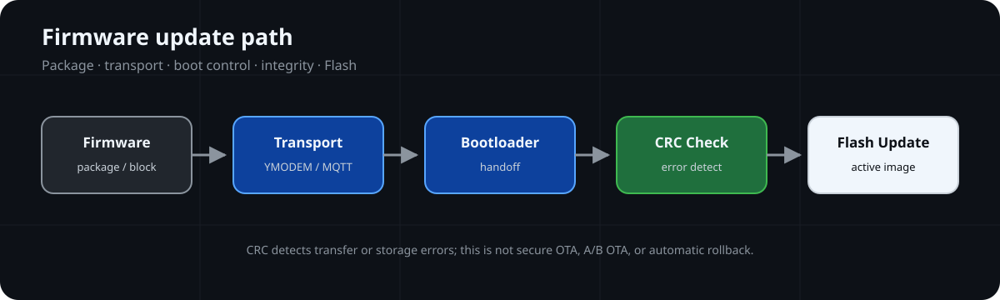

# Embedded-OTA-Update-Lab

面向 Cortex-M 的 Bootloader、Flash layout、UART/YMODEM、MQTT transport 与 CRC 边界架构文档实验。

**🔄 Update Pipeline**



## Update Snapshot

| Update Focus | Current Scope |
| --- | --- |
| Repository Type | Firmware Update Architecture Lab |
| Reference MCU | GD32F407VE / ARM Cortex-M4 |
| Local Path | UART / YMODEM IAP model |
| Network Path | MQTT block transport model |
| Integrity Boundary | CRC error detection；no authentication, encryption or rollback claim |
| Public Implementation | Not included in the current default branch |
| Verification | Architecture review；build, Flash-write and boot evidence not provided |

## 📌 Overview

仓库以原创文档和 SVG 描述 Bootloader / Application 边界、Flash 分区、向量跳转、UART/YMODEM IAP、MQTT 分块传输、更新元数据和 CRC 错误检测。

当前默认分支不分发课程 Bootloader、Flash/YMODEM/ESP8266/MQTT 应用代码、GD32/CMSIS 厂商组件、startup 或 Keil 工程。Staging Backup 不是可启动 Slot B；文档不声明 A/B OTA、Automatic Rollback、Secure OTA、签名验证或生产级更新能力。

## 🏗️ Architecture


```text
                  ┌─ UART / YMODEM ─┐
Firmware Source ──┤                  ├── Flash / Staging ── CRC ── Boot Handoff
                  └─ MQTT Transport ─┘
```

UART/YMODEM 与 MQTT 是独立 transport model。CRC 只表达传输或存储错误检测，不提供来源认证、保密性或防回滚能力。

## ✨ Key Features

| Capability | Documentation Entry |
| --- | --- |
| Boot/Application boundary | [Bootloader Architecture](docs/bootloader-architecture.md) |
| Vector handoff | [Application Jump](docs/application-jump.md) |
| Flash partition model | [Flash Layout](docs/flash-layout.md) |
| UART/YMODEM model | [YMODEM IAP](docs/ymodem-iap.md) |
| MQTT block model | [MQTT Block Transport](docs/mqtt-block-transport.md) |
| Integrity and failure boundary | [Image Integrity](docs/image-integrity.md) and [Failure Boundaries](docs/failure-boundaries.md) |

## 📂 Project Structure

```text
Embedded-OTA-Update-Lab/
├── README.md
├── LICENSE
├── THIRD_PARTY_NOTICES.md
├── assets/images/  # Repository-authored architecture and flow SVG
└── docs/           # Firmware-update architecture documentation
```

## 📚 Documentation

- [Bootloader Architecture](docs/bootloader-architecture.md)
- [Flash Layout](docs/flash-layout.md)
- [Application Jump](docs/application-jump.md)
- [YMODEM IAP](docs/ymodem-iap.md)
- [OTA Control Plane](docs/ota-control-plane.md)
- [MQTT Block Transport](docs/mqtt-block-transport.md)
- [Image Integrity](docs/image-integrity.md)
- [Failure Boundaries](docs/failure-boundaries.md)
- [Development Environment](docs/development-environment.md)

## 🧪 Verification

| Verification Layer | Status | Boundary |
| --- | --- | --- |
| Host Test | NOT PROVIDED | No public parser, state machine, or CRC test implementation |
| Build Verification | NOT PROVIDED | No current Keil project or firmware source is distributed |
| Hardware Validation | NOT PROVIDED | No reviewable Flash, UART, network, or boot result |
| Runtime Evidence | NOT PROVIDED | No transfer log, Flash trace, MQTT session, or boot record |

## License Boundary

根目录 MIT License 仅覆盖当前默认分支中仓库维护者编写的文档、配置与自绘 SVG。课程源码、GD32/CMSIS、startup、Keil 工程和第三方 transport 实现未包含在当前默认分支；旧提交中的历史文件仍需单独评估。详见 [THIRD_PARTY_NOTICES.md](THIRD_PARTY_NOTICES.md)。
