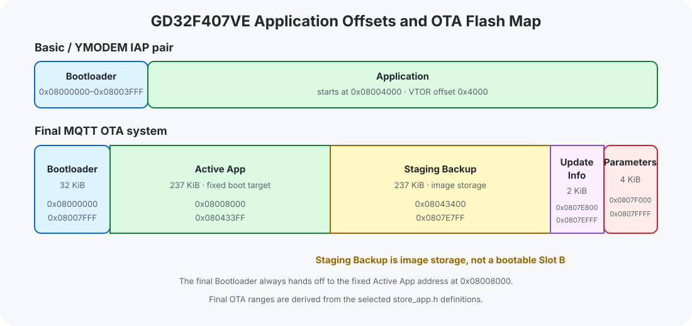

# Flash Layout

GD32F407VE 工程按 512 KiB 内部 Flash 组织。基础/IAP 与最终 OTA 使用两套不同的 Application 起点。

## 基础与 IAP

```text
0x08000000  Bootloader
0x08004000  Application
```

Bootloader 预留 16 KiB；配对 Application 使用 `0x4000` 的 vector-table offset。

## 最终 OTA



地址与大小由最终 Bootloader 的 [`Common/store_app.h`](../projects/05-mqtt-ota-system/bootloader/course/Common/store_app.h) 推导：

| Region | Address range | Size | Role |
|---|---|---:|---|
| Bootloader | `0x08000000`–`0x08007FFF` | 32 KiB | 更新与启动控制 |
| Active App | `0x08008000`–`0x080433FF` | 237 KiB | 固定启动的 Application image |
| Staging Backup | `0x08043400`–`0x0807E7FF` | 237 KiB | 下载暂存与复制来源 |
| Update Info | `0x0807E800`–`0x0807EFFF` | 2 KiB | 更新标志 |
| Parameters | `0x0807F000`–`0x0807FFFF` | 4 KiB | 版本与参数记录 |

`Staging Backup` 与 Active App 大小相同，但 Bootloader 不从 staging 地址启动，也没有 active/pending/confirmed Slot 状态。因此它是 image storage 与 copy source，不是 A/B firmware partition。

## Link configuration 边界

Application 工程的 Keil Flash 起点与 `VTOR` offset 匹配，但原工程 region length 仍使用 `0x80000`，没有把 link 上限限制为 237 KiB Active App 分区。该配置事实不能等同为分区边界已由 linker 强制保护。

## 工程入口

- [Bootloader / Application Split](../projects/02-boot-app-split/)
- [MQTT OTA System](../projects/05-mqtt-ota-system/)

[上一篇：Bootloader Architecture](bootloader-architecture.md) · [返回 README](../README.md) · [下一篇：Application Jump](application-jump.md)
